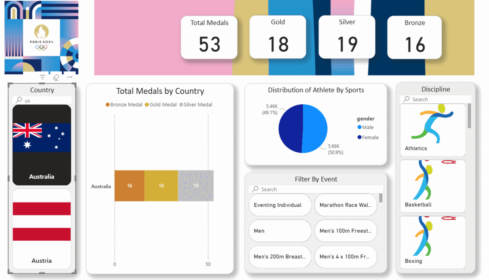

# 🏅 Paris 2024 Olympics – Power BI Dashboard


A quick look at Olympic Paris 2024 results and trends, visualized in Power BI. This dashboard allows us to explore medal counts, country rankings and discipline specific trends at the 2024 Paris Olympics.


<br>

## 📊 Dashboard Preview


<br>

## 🔍 Key Questions Explored

1. Which countries dominated Swimming medals at Paris 2024?

2. Which countries dominated Badminton medals at Paris 2024?

3. Who are the top 3 male singles badminton players at Paris 2024 based on medal count?

4. Which events or disciplines contributed most to Malaysia’s medals?  

5. How does Malaysia’s medal count in Badminton compare to neighbouring Southeast Asian countries like Indonesia, Thailand, and Singapore?

## 🧠 Findings 

```text
1. Which countries dominated Swimming medals at Paris 2024?
```
.png) 

The United States dominated Swimming at the 2024 Paris Olympics, securing a total of 28 medals with  8 Gold, 13 Silver, and 7 Bronze. Australia followed closely with 18 medals with 7 Gold, 8 Silver, 3 Bronze, while China earned 12 medals with 2 Gold, 3 Silver, 7 Bronze. Overall, the medal distribution highlights the dominance of the US and Australia in swimming events, with Chin

---

```text
2. Which countries dominated Badminton medals at Paris 2024?
```
.png) 

China dominated the Badminton events at the 2024 Paris Olympics, winning a total of 5 medals with 2 Gold and 2 Silver. Korea earned 2 medals, both Silver, while Japan and Malaysia each secured 2 Bronze medals. Out of 15 total medals awarded, these countries accounted for the majority of the podium finishes, highlighting China’s continued strength in badminton and the competitive presence of Korea, Japan, and Malaysia.

---
```text
3. Who are the top 3 male singles badminton players at Paris 2024 based on medal count?
```
.png) 

In the men’s singles badminton event, the gold medal was claimed by a player from Denmark, followed by Malaysia taking silver and Thailand earning bronze. This podium highlights the strong performances of Southeast Asian countries alongside Denmark’s continued excellence in badminton.

--- 

```text
4. Which events or disciplines contributed most to Malaysia’s medals?  
```
.png) 

Malaysia secured a total of 2 Bronze medals, both coming from Badminton, which was the only discipline contributing to the country’s medal tally. This underscores Malaysia’s continued strength in badminton at the Olympic level and highlights the sport as the primary source of the nation’s podium finishes in Paris 2024.

---

```text
5. How does Malaysia’s medal count in Badminton compare to neighbouring Southeast Asian countries like Indonesia, Thailand, and Singapore?
```

| Indonesia | Singapore |
|-------------------|-----------------|
| .png) | .png) | 

| Malaysia | Thailand |
|-------------------|-----------------|
| .png) | .png) | 

In badminton at Paris 2024, Thailand led the South East Asian medal tally with 6 medals (1 Gold, 1 Silver, 4 Bronze), followed by Indonesia with 3 medals (2 Gold, 1 Bronze). Malaysia secured 2 Bronze medals, placing third among regional competitors, while Singapore earned 1 Bronze. Notably, Malaysia did not win Gold or Silver, highlighting Thailand and Indonesia as the dominant regional forces in badminton for these Olympics.


## 📚 References & Credits
- Official Paris 2024 Olympics website: [https://www.paris2024.org](https://www.paris2024.org)
- Paris 2024 Olympics Dashboard Project in PowerBI with Python in Youtube: https://www.youtube.com/watch?v=rMYacj8PreA
- Anas B.